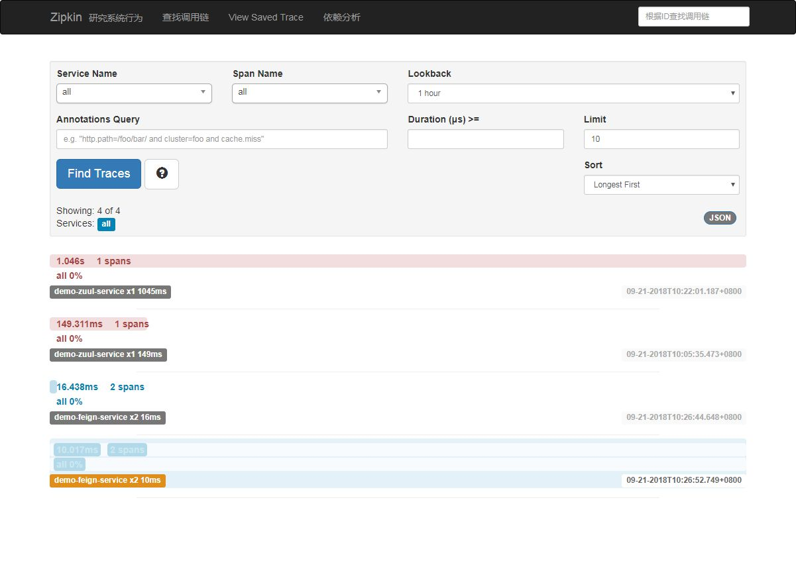

## SpringCloud Demo Project

### 1、这是一个Spring Cloud Demo 项目，以下是各个模块的说明：

- config-cloud : 项目的各个模块的配置文件。
- demo-config：配置中心服务，主要用于给其他服务提供提供配置项的更新。
- demo-config-client：配置中心的消费服务，测试用的。
- demo-eureka：服务治理服务，提供服务的注册发现服务。
- demo-feign：feign的使用demo，调用demo-hello的服务。。
- demo-hello：一个实例服务demo，生产者。
- demo-hystrix-dashboard：hystrix 的控制台。
- demo-ribbon：ribbon的使用demo，调用demo-hello的服务。
- demo-turbine：turbine 的控制台。
- demo-zuul：网关服务，主要过滤无效请求，经过过滤后的请求分发到demo-feign服务和demo-ribbon服务。

### 2、配置说明

- 项目依赖rabbit-mq，需要先安装rabbit-mq，安装方式请自行百度。安装完成后将rabbit-mq的用户名、密码及监听端口配置在demo-config 模块的 application.xml文件中即可：

```yaml
## ...
	## 开启消息跟踪
    bus:
      enabled: true
      trace:
        enabled: true
  rabbitmq:
    host: localhost
    port: 5672
    username: guest
    password: guest
    
## ...
```
rabbit-mq管理界面如图所示：


- 分布式服务跟踪 zipkin 配置：

  请自行下载zipkin安装包，并在本地启动，启动命令：

  ```shell
  java -jar zipkin-server-2.9.4-exec.jar
  ```

启动成功后，在浏览器中输入：`http://localhost:9411` （zipkin默认监听9411端口）。



以上就显示了服务调用之间的链路和各链路所耗费的时间，给服务优化提供依据。

- hystrix 的控制台，主要监控服务的状态和业务压力：

  


### 3、待续...